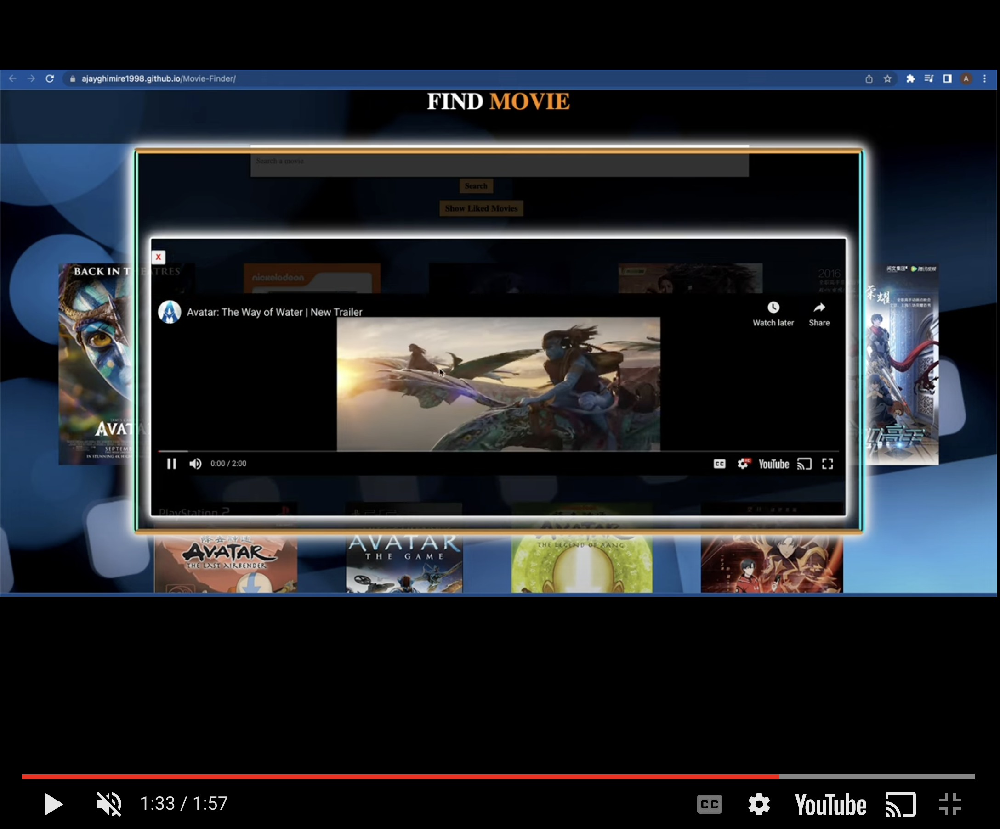

# MovieFinder - A JS app to search movies and watch trailers

[Try here](https://ajayghimire1998.github.io/Movie-Finder/)


## Overview

MovieFinder is a JavaScript web application built with OMDB and YOUTUBE API. 

The users can search for a movie with its title name and get all information about the selected movie and also watch the trailer of the movie from youtube.

<br>
<br>

[Live Demo](https://youtu.be/L78bUwIzYYo)

<br>
<br>

[](https://youtu.be/L78bUwIzYYo 
"Movie-Finder")


## Features

1. **Search Movie:** Search for a movie or a tv show with its title.


2. **View Details:** View information about the selected movie or show. 


3. **Watch Trailer:** Watch trailer of the selected movie or show from youtube.


4. **Like:** Like the selected movie or show to save in the liked list.


5. **View Liked List:** View a list of liked movies and shows.


## Technologies Used

- **Vanilla JS:** The front-end is built using plain Vanilla JavaScript, HTML and CSS providing a dynamic and responsive user interface.

- **OMDb API:** Movies and Shows data are fetched from OMDb API, an open movie database.

- **YouTube API:** Trailer of the selected movie or show is fetched to see by using YouTube API.


## Getting Started

1. **Clone the Repository:**
   ```bash
   git clone https://github.com/AjayGhimire1998/Movie-Finder.git

   

2. **Run the App:**
   ```bash
  Live Server

   
3. **Access GoalsToScore:**
   Open your browser and navigate to http://localhost:3000 to use Movie-Finder locally.


## Contributing

I welcome contributions to make Movie-Finder even more intuitive and user-friendly. Feel free to submit issues, feature requests, or pull requests.

## License

This project is licensed under the MIT License.

## Acknowledgments

Thanks to the developers of OMDb API and YouTube API for providing valuable contents and tools.


# Enjoy Movie-Finder and happy-movie-hunting! 🎉


