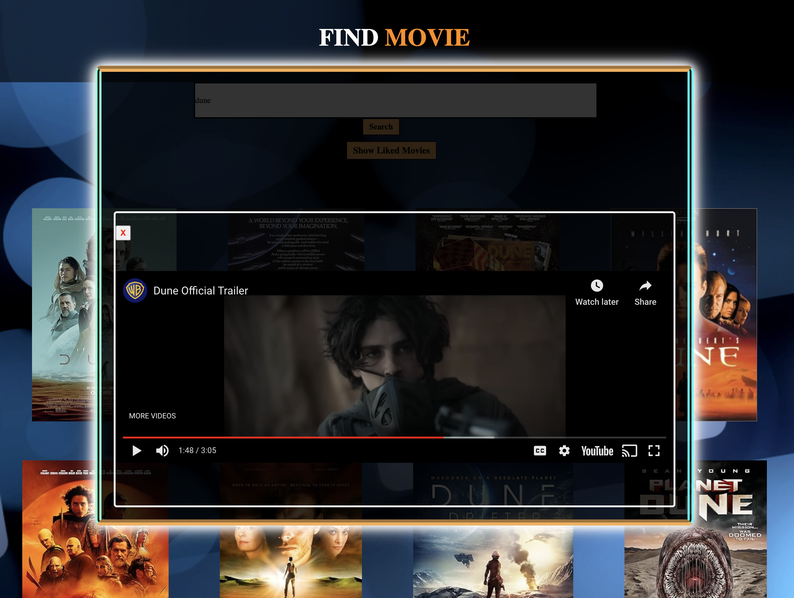

# MovieFinder - A JS app to search movies and watch trailers

[Try here](https://ajayghimire1998.github.io/Movie-Finder/)


## Overview

MovieFinder is a JavaScript web application built with OMDB and YOUTUBE API. 

The users can search for a movie with its title name and get all information about the selected movie and also watch the trailer of the movie from youtube.

<br>
<br>

[Live Demo](https://youtu.be/L78bUwIzYYo)

<br>
<br>

[](https://youtu.be/L78bUwIzYYo 
"Movie-Finder")


## Features

1. **Search Movie:** Search for a movie or a tv show with its title.


2. **View Details:** View information about the selected movie or show. 


3. **Watch Trailer:** Watch trailer of the selected movie or show from youtube.


4. **Like:** Like the selected movie or show to save in the liked list.


5. **View Liked List:** Add tasks later on the go, and delete the whole goal once accomplished.


## Technologies Used

- **React.js:** The front-end is built using React.js, providing a dynamic and responsive user interface.

- **Node.js:** Express.js and MongoDb is used for authentication and storage, ensuring a secure and scalable solution.

- **React Hooks and Contexts:** State management in GoalsToScore is handled efficiently with React Hooks and Contexts, providing a seamless user experience.


## Getting Started

1. **Clone the Repository:**
   ```bash
   git clone https://github.com/AjayGhimire1998/goals-to-score.git


2. **Install Dependencies:**
   ```bash
   cd goals-to-score
   npm install
   

4. **Run the App:**
   ```bash
   npm start

   
5. **Access GoalsToScore:**
   Open your browser and navigate to http://localhost:3000 to use GoalsToScore locally.


## Contributing

I welcome contributions to make GoalsToScore even more entertaining and user-friendly. Feel free to submit issues, feature requests, or pull requests.

## License

This project is licensed under the MIT License.

## Acknowledgments

Thanks to the developers of React.js, Redux.js, Express.js, MongoDB, for providing valuable content and tools.


# Enjoy GoalsToScore and happy-productivity! 🎉


